# Graph Workflow System Guide

> Version: 2.0.0 | Last Updated: 2026-03-12 | ccbuilder v2.17.0+

## 개요

Graph Workflow는 사용자의 자연어 요청을 구조화된 실행 계획(Graph)으로 변환하고, LLM이 이를 따라 실행하는 시스템이다. 별도 런타임 없이 Claude Code의 기존 도구(Task, Skill, Hook)로 동작한다.

### 핵심 원칙

- Graph는 코드가 아니라 LLM을 위한 실행 계획서
- 자연어 → Graph 변환이 핵심 가치
- 실행은 기존 Claude Code 도구로
- **Shared State**: 노드 간 공유 상태(workspace + raw_vault)로 context 단절 해결
- **Adversarial Verification**: 찾는 에이전트와 검증하는 에이전트를 분리하여 품질 보장
- **Multi-strategy Parallel**: 동일 목표를 다른 전략으로 병렬 검색하여 소스 다양성 확보
- 로그 축적 → 패턴 분석 → Graph 개선

## Graph Schema

### 최소 구조

```json
{
  "id": "string — graph 식별자",
  "goal": "string — 이 graph가 달성하려는 목표 (자연어)",
  "state": {
    "workspace": ".omc/state/graph/{id}/workspace.md",
    "raw_vault": ".omc/state/graph/{id}/raw/"
  },
  "nodes": [],
  "flow": [],
  "limits": { "max_cycles": 3, "timeout": "10m" }
}
```

### State (v2 신규)

| 필드 | 설명 | 기본값 |
|------|------|--------|
| `workspace` | 전체 노드가 점진적으로 작성하는 공유 문서 | `.omc/state/graph/{id}/workspace.md` |
| `raw_vault` | 원본 데이터 저장 디렉토리 (요약 손실 방지) | `.omc/state/graph/{id}/raw/` |

**왜 필요한가**: v1에서 노드 간 정보가 output.json 요약으로만 전달되어 context 단절/정보 손실이 발생했다. Shared State로 원본 보존 + 누적 지식을 해결한다.

### Node 객체

```json
{
  "id": "string — 노드 식별자",
  "do": "string — type:name 형식 (예: agent:explore, decision, tool:bash)",
  "with": "string — 입력/컨텍스트 설명 (자연어, LLM이 해석)",
  "output": "string — 이 노드가 생성하는 결과 (자연어)",
  "reads": ["optional — 이 노드가 읽을 상태/노드 출력. 예: state.workspace, node_id.artifacts.raw"],
  "writes": ["optional — 이 노드가 기록할 상태. 예: state.workspace"],
  "artifacts": { "raw": "optional — raw_vault 내 원본 데이터 저장 경로" },
  "autonomy": false,
  "context_files": ["optional — 노드 컨텍스트에 주입할 정적 파일 경로"],
  "on_error": "optional — retry:2 | fallback:node_id | abort"
}
```

### v2 신규 필드 상세

| 필드 | 타입 | 설명 |
|------|------|------|
| `reads` | `string[]` | 이 노드가 읽을 이전 노드 출력 또는 공유 상태. `"state.workspace"`, `"node_id"`, `"node_id.artifacts.raw"` 형식 |
| `writes` | `string[]` | 이 노드가 결과를 기록할 공유 상태. `"state.workspace"` 형식 |
| `artifacts` | `object` | 노드가 생성하는 영구 파일. `raw`: raw_vault 내 원본 데이터 경로 |
| `autonomy` | `boolean` | `true`면 subagent가 추가 웹 검색, 파일 읽기 등 자율 행동 가능. Skill의 유연성을 노드에 부여 |

### Node Types

| type | do format | 실행 방식 | 예시 |
|------|-----------|----------|------|
| agent | `agent:<name>` | Task() subagent spawn | `agent:explore`, `agent:executor` |
| skill | `skill:<name>` | Skill() 호출 | `skill:eval`, `skill:commit` |
| decision | `decision` | LLM이 조건 평가 후 분기 | `check: "score >= 90"` |
| tool | `tool:<name>` | 직접 도구 호출 | `tool:bash`, `tool:read` |
| subgraph | `subgraph:<id>` | 다른 graph를 노드로 실행 | `subgraph:eval-pipeline` |

### Flow Notation

사람이 읽을 수 있는 흐름 표기법:

- **Sequential**: `"A → B → C"`
- **Parallel**: `"A → [B, C] → D"` (B, C 병렬 실행, D는 둘 다 완료 후 실행)
- **Conditional**: `"decide.pass → END"`, `"decide.fail → improve"`
- **Loop**: `"improve → eval_a"` (back-edge, `limits.max_cycles`로 제한)

### Decision Node

Decision 노드는 agent를 spawn하지 않는다. LLM 자체가 조건을 평가한다.

**v1 모드 (이진 분기)** — `pass`/`fail`만 있으면 기존 동작:

```json
{
  "id": "decide",
  "do": "decision",
  "check": "grade.score >= 90",
  "routes": { "pass": "END", "fail": "improve" }
}
```

**v2 모드 (다중 분기)** — `route_criteria` 존재 시 multi-route:

```json
{
  "id": "quality_gate",
  "do": "decision",
  "check": "SCAR 점수와 정보 완전성을 종합 평가",
  "routes": {
    "complete": "synthesize",
    "has_gaps": "fill_gaps",
    "low_quality": "web_search"
  },
  "route_criteria": {
    "complete": "SCAR >= 85, 모든 사실 2+ 소스 검증, gaps 없음",
    "has_gaps": "SCAR >= 70, gaps 또는 low_confidence 존재",
    "low_quality": "SCAR < 70 또는 verified 사실이 전체의 50% 미만"
  }
}
```

**Multi-route 규칙**:
- `route_criteria`의 조건은 **MECE(상호배타적/전체포괄적)** 권장
- 최대 5개 경로 제한 (초과 시 LLM 판단 정확도 하락)
- 어떤 조건에도 매칭 안 되면 마지막 경로를 fallback으로 사용
- `check` 필드는 사람이 읽을 수 있는 전체 평가 기준 요약

`check` 필드는 사람이 읽을 수 있는 조건이다. LLM이 workspace 및 참조된 노드의 output을 읽고 평가한다.

## 자연어 → Graph 변환 패턴

이것이 시스템의 핵심 가치다. 자연어를 graph 구조로 변환하는 패턴 라이브러리:

### 기본 패턴

| 자연어 패턴 | Graph 구조 | 예시 |
|------------|-----------|------|
| "A 해줘" | Single node | "코드 리뷰해줘" → 1 node |
| "A하고 B해줘" | A → B (sequential) | "테스트 작성하고 실행해줘" |
| "A하면서 B도 해줘" | [A, B] (parallel) | "프론트 수정하면서 백엔드도 고쳐줘" |
| "A 결과 보고 판단해줘" | A → Decision → {routes} | "리뷰 결과 보고 머지할지 결정해줘" |
| "될 때까지 반복해줘" | Loop (A → verify → Decision → A) | "테스트 통과할 때까지 고쳐줘" |
| "A한 다음에 B로 검증해줘" | A → B(verifier) | "구현하고 테스트로 검증해줘" |
| "먼저 조사하고 계획 세워줘" | explore → plan (sequential) | "코드베이스 파악하고 리팩토링 계획 세워줘" |

### 복합 패턴

| 자연어 패턴 | Graph 구조 |
|------------|-----------|
| "A/B 비교해줘" | [A, B] → compare → decide |
| "팀으로 작업해줘" | plan → [exec_1, exec_2, ...] → verify → decide |
| "완성될 때까지 자율적으로 해줘" | plan → exec → verify → decide → (loop or END) |
| "단계별로 진행하고 매번 확인해줘" | step1 → review1 → step2 → review2 → ... |

### 키워드 → 노드 매핑

| 키워드 | Node type | Agent/Tool |
|--------|-----------|-----------|
| 분석, 조사, 파악 | `agent:explore` | explore (haiku) |
| 계획, 설계 | `agent:planner` | planner (opus) |
| 구현, 작성, 수정 | `agent:executor` | executor (sonnet) |
| 리뷰, 검토 | `agent:code-reviewer` | code-reviewer (opus) |
| 테스트 | `agent:test-engineer` | test-engineer (sonnet) |
| 검증, 확인 | `agent:verifier` | verifier (sonnet) |
| 디버그, 버그 | `agent:debugger` | debugger (sonnet) |
| 빌드 에러 | `agent:build-fixer` | build-fixer (sonnet) |
| 보안 | `agent:security-reviewer` | security-reviewer (sonnet) |
| 문서 | `agent:writer` | writer (haiku) |

## 실행 프로토콜

### Phase 1: Graph 생성

1. 사용자 요청 분석
2. 변환 패턴 매칭
3. **v2 설계 체크리스트 적용** (아래 참조)
4. Graph JSON 생성
5. (선택) 사용자에게 Graph 시각화하여 확인

### v2 설계 필수 체크리스트

**모든 Graph 설계 시 아래 항목을 반드시 적용한다.** 이는 Graph의 품질을 Skill 수준 이상으로 보장하기 위한 필수 규칙이다.

#### 1. Shared State (필수)

```json
"state": {
  "workspace": ".omc/state/graph/{id}/workspace.md",
  "raw_vault": ".omc/state/graph/{id}/raw/"
}
```

- 모든 Graph에 `state` 필드를 포함한다
- `workspace`: 노드 간 누적 문서. context 단절 방지의 핵심
- `raw_vault`: 원본 데이터 보존 디렉토리

#### 2. reads/writes (필수)

- **모든 비-첫번째 노드**에 `reads` 배열을 선언한다
  - 최소: `["state.workspace"]` 또는 이전 노드 ID
  - 원본이 필요하면: `["node_id.artifacts.raw"]`
- **데이터를 생산하는 모든 노드**에 `writes: ["state.workspace"]`를 선언한다
- reads/writes가 없으면 노드가 고립되어 context 단절 발생 → **금지**

#### 3. artifacts (데이터 수집 노드에 필수)

```json
"artifacts": {"raw": "raw_vault/source_name.json"}
```

- 웹 검색, API 호출, 파일 분석 등 **원본 데이터를 수집하는 노드**에는 반드시 `artifacts.raw` 선언
- 원본 보존이 lossy compression 방지의 핵심
- 각 노드의 artifacts 경로는 고유해야 한다

#### 4. autonomy (검증/보충 노드에 권장)

```json
"autonomy": true
```

- 검증(verifier), 갭 보충(gap-fill), 심층 분석 노드에 `autonomy: true` 설정
- Skill의 자율 탐색 능력을 Graph 노드에 부여하는 핵심 메커니즘
- 단순 변환/집계 노드에는 불필요 (false 또는 생략)

#### 5. Multi-route Decision (3개 이상 경로가 필요하면 필수)

- 이진(pass/fail)이 충분하면 v1 모드 사용 가능
- 품질 등급별 분기가 필요하면 반드시 `route_criteria`와 함께 multi-route 사용
- `route_criteria` 조건은 **MECE** (상호배타적/전체포괄적)
- 최하위 경로는 **재시도 루프**로 연결 (low_quality → 초기 노드)

#### 6. Adversarial Verification (리서치/분석 Graph에 필수)

- 정보를 **찾는 노드**와 **검증하는 노드**를 반드시 분리
- 검증 노드는 **3가지 유형의 오류**를 반드시 점검:
  1. **사실과 다른 정보** (incorrect): 원본 소스와 대조하여 사실 여부 확인. 2+ 독립 소스 교차확인 필수
  2. **모순되는 정보** (contradictory): 소스 간 상충하는 내용 식별. 어느 소스가 더 신뢰할 수 있는지 판단
  3. **모호한 정보** (ambiguous): 해석이 여러 가지인 내용 식별. 추가 확인 필요 사항 명시
- 검증 결과는 **3분류 체계**로 기록:
  - `verified`: 2+ 독립 소스로 확인된 사실
  - `disproven`: 반박에 성공한 항목 (사유 기록)
  - `uncertain`: 추가 확인이 필요한 모호한 항목 (필요 정보 명시)
- 검증 노드: `autonomy: true` (추가 검색으로 교차확인 가능)
- **삼각검증 노드**: verified 사실만 최종 포함, uncertain → gaps[], disproven → 주의사항
- "찾기 → 검증 → 삼각검증" 3단계가 리서치 품질의 핵심

#### 7. Ralph Loop (반복 개선이 필요하면 적용)

```json
"ralph": {
  "enabled": true,
  "target": "자연어 목표 조건",
  "max_iterations": 5,
  "evolve": true
}
```

- 단일 실행으로 목표 달성이 어려운 Graph에 적용
- `evolve: true`면 매 반복 후 graph.json 자체를 개선 가능
- `target`: SCAR >= 95, all tests pass 등 명확한 종료 조건

#### 설계 체크리스트 요약표

| 항목 | 적용 대상 | 필수/권장 |
|------|----------|----------|
| state (workspace + raw_vault) | 모든 Graph | **필수** |
| reads/writes | 모든 노드 (첫 노드 제외) | **필수** |
| artifacts.raw | 데이터 수집 노드 | **필수** |
| autonomy: true | 검증/보충/심층 노드 | 권장 |
| multi-route + route_criteria | 3개 이상 분기 | **필수** |
| adversarial verification | 리서치/분석 Graph | **필수** |
| ralph | 반복 개선 필요 시 | 권장 |

### Phase 2: Graph 실행

1. Execution state 파일 생성: `.omc/state/graph/{id}/execution.json`
2. **Shared State 초기화** (v2): `state.workspace` 파일 생성, `state.raw_vault` 디렉토리 생성
3. 현재 노드 확인 (execution state에서)
4. 노드 실행:
   - **agent 노드**: Task() spawn with prompt constructed from:
     - node's `with` (자연어 지시)
     - `reads`에 명시된 상태/노드 출력 **전문** 주입 (요약이 아닌 원본)
     - `context_files` (정적 파일)
     - `autonomy: true`면 "필요 시 추가 웹 검색/파일 읽기 가능" 권한 부여
   - **decision 노드**: workspace + output 파일 읽고 조건 평가
     - `route_criteria` 있으면 multi-route 모드: 각 조건 순서대로 평가하여 첫 매칭 경로로 분기
   - **tool 노드**: 직접 도구 호출
   - **skill 노드**: Skill() 호출
   - **subgraph 노드**: 참조된 graph를 재귀적으로 실행
5. **writes 처리** (v2): `writes`에 명시된 상태에 결과 기록 (예: workspace.md에 append)
6. **artifacts 저장** (v2): `artifacts.raw`에 명시된 경로에 원본 데이터 저장
7. 결과를 `.omc/state/graph/{id}/{node_id}.output.json`에 저장
8. 노드 로그를 `.omc/logs/graphs/{id}/{node_id}.log.json`에 저장
9. execution state 업데이트 (completed nodes, current node)
10. flow에 따라 다음 노드 결정
11. 반복

### Shared State 실행 규칙 (v2)

- **reads**: 노드 실행 시 reads에 명시된 파일/상태의 **전문**을 Task prompt에 주입. 요약본이 아님
- **writes**: 노드 완료 시 결과를 writes 대상에 **append**. 기존 내용 유지
- **artifacts.raw**: 원본 데이터를 raw_vault에 파일로 저장. 다른 노드가 `reads: ["node_id.artifacts.raw"]`로 참조 가능
- **autonomy**: `true`인 노드의 subagent에게 WebSearch, WebFetch, Read 등 도구 사용 권한을 추가 부여. 단, writes 범위 밖의 파일 수정은 금지
- **Lazy Loading**: reads 대상이 50KB 초과 시, 요약 + 파일 경로를 전달하고 "원본 확인이 필요하면 Read 도구를 사용하라"고 지시

### Phase 3: 완료

1. END 도달 또는 limits 초과
2. 최종 결과 사용자에게 보고
3. execution summary 저장

### Execution State 파일 구조

```json
{
  "graph_id": "eval-pipeline-v1",
  "execution_id": "exec-20260312-001",
  "status": "running",
  "started_at": "2026-03-12T10:00:00Z",
  "current_nodes": ["grade"],
  "completed_nodes": ["explore", "eval_a", "eval_b"],
  "failed_nodes": [],
  "cycle_count": 0,
  "total_tokens": 12400,
  "total_duration_ms": 45000
}
```

### Node Output 파일 구조

```json
{
  "node_id": "explore",
  "status": "completed",
  "output": {},
  "summary": "12 files identified, 3 test files, main skill at skills/foo/SKILL.md",
  "confidence": {
    "completeness": 0.9,
    "accuracy": 0.85,
    "gaps": ["팀원 E의 직책 미확인"]
  }
}
```

v2에서 `confidence` 블록이 추가되어 다음 노드가 "어디가 부족한지"를 구조적으로 파악한다. `gaps`가 비어있지 않으면 quality_gate에서 `has_gaps` 경로로 분기된다.

## 로깅 & 관찰성

### Node Log 구조

```json
{
  "node_id": "grade",
  "execution_id": "exec-20260312-001",
  "started_at": "2026-03-12T10:01:00Z",
  "completed_at": "2026-03-12T10:01:12Z",
  "duration_ms": 12000,
  "tokens_used": 4200,
  "status": "completed",
  "input_summary": "eval_a output (85), eval_b output (62)",
  "output_summary": "quality_score: 78, 3 improvements identified",
  "error": null,
  "decision": null,
  "retry_count": 0
}
```

Decision 노드의 경우 `decision` 필드가 분기 정보를 기록한다:

```json
{
  "decision": {
    "condition": "grade.score >= 90",
    "actual_value": 78,
    "result": "fail",
    "routed_to": "improve",
    "reasoning": "Score 78 is below 90 threshold"
  }
}
```

### Execution Timeline (Mermaid)

실행 완료 후 mermaid 다이어그램을 생성한다:

```mermaid
gantt
    title Graph Execution: eval-pipeline-v1
    dateFormat X
    axisFormat %s

    section Sequential
    explore      :done, 0, 5
    section Parallel
    eval_a       :done, 5, 12
    eval_b       :done, 5, 15
    section Sequential
    grade        :done, 15, 20
    decide       :done, 20, 21
    improve      :active, 21, 30
```



## Ralph-Graph Loop (Phase 2.5 — 자기 개선 반복)

Graph에 `ralph.enabled: true`가 설정되면, 단일 실행이 아니라 **Fresh Context 반복 루프**로 실행된다. 매 반복마다 Graph 자체를 개선하여 품질 목표를 달성할 때까지 자율 반복한다.

### 왜 필요한가

Graph v3에서 SCAR 85.1을 달성했지만, SCAR 95+를 목표로 하면 단일 실행으로는 한계가 있다:
- 51K 토큰 소비 후 Context 열화 시작
- 한 번에 모든 소스를 찾기 어려움
- Graph 구조 자체의 한계 (노드 순서, 전략 등)를 실행 중에는 바꿀 수 없음

Ralph-Graph Loop는 매 반복마다:
1. Fresh Context(0%)로 시작
2. 이전 반복의 feedback을 읽고 Graph를 개선
3. 개선된 Graph를 실행
4. 결과를 평가하고 다음 반복을 위한 feedback 생성

### Ralph-Graph 스키마

```json
{
  "id": "research-team-v3",
  "goal": "SCAR 95+ 달성",
  "ralph": {
    "enabled": true,
    "target": "avg SCAR >= 95 AND all facts verified by 2+ sources",
    "max_iterations": 5,
    "evolve": true,
    "feedback_file": ".omc/state/graph/{id}/feedback.md"
  },
  "state": { "workspace": "...", "raw_vault": "..." },
  "nodes": [...],
  "flow": [...]
}
```

### 실행 프로토콜

```
Iteration 1 (Fresh Context — 0%):
  1. Read graph.json
  2. Execute Graph (Phase 1-3)
  3. Evaluate: SCAR = 85.1, target = 95 → NOT MET
  4. Write feedback.md:
     - "official_search에서 EMSS 2024 상세 누락 → 키워드에 'EMSS' 추가 필요"
     - "social_search에서 Threads/Mastodon 미탐색 → strategy 확장 필요"
     - "adversarial에서 학력 정보 미검증 → deep_search에 학력 DB 검색 추가"
  5. Write PROGRESS.md: "Iteration 1: SCAR 85.1, 14 sources, 18 verified facts"

Iteration 2 (Fresh Context — 0%):
  1. Read graph.json + feedback.md + PROGRESS.md
  2. evolve=true이므로 graph.json 수정:
     - keywords 노드의 with에 "EMSS, Threads, Mastodon" 추가
     - social_search에 Threads/Mastodon 전략 추가
     - deep_search에 학력 DB 검색 추가
  3. Execute improved Graph
  4. Evaluate: SCAR = 91.2 → NOT MET
  5. Write feedback.md (append): "Grade C 소스 3개 → 대체 소스 탐색 필요"

Iteration 3 (Fresh Context — 0%):
  ...

Iteration N:
  SCAR >= 95 → Write LOOP_COMPLETE to PROGRESS.md → Exit
```

### Feedback 파일 구조

```markdown
# Graph Feedback — {graph_id}

## Iteration 1 (SCAR: 85.1)
### 개선 필요 항목
- [ ] keywords: EMSS 2024 관련 키워드 누락
- [ ] social_search: Threads/Mastodon 미탐색
- [ ] adversarial: 학력 정보 검증 부족
### Graph 수정 제안
- keywords.with에 "EMSS 2024, Threads, Mastodon" 추가
- deep_search.with에 "학력 DB, 대학교 동문 네트워크" 추가

## Iteration 2 (SCAR: 91.2)
### 개선 필요 항목
- [ ] Grade C 소스 3개 → P1/P2 대체 소스 필요
### Graph 수정 제안
- news_search 전략에 "2024-2025 최신 기사 우선" 조건 추가
```

### evolve 규칙 (Graph 자기 개선)

`evolve: true`일 때 매 반복에서 Graph를 수정할 수 있다. 단, 다음 규칙을 따른다:

1. **추가 허용**: 새 노드 추가, 기존 노드의 `with` 수정, `reads`/`writes` 변경
2. **삭제 주의**: 노드 삭제는 feedback에서 "이 노드가 0개 유효 결과를 생성함"일 때만
3. **구조 보존**: `flow`의 기본 구조(병렬 검색 → 검증 → 삼각검증 → 게이트)는 유지
4. **이력 보존**: 수정된 graph.json은 `graph.v{N}.json`으로 이전 버전 백업
5. **수렴 감지**: 2회 연속 SCAR 변화 < 1.0이면 "수렴 판단" → 현재 결과로 종료

### SCAR 100을 위한 현실적 가이드

SCAR 100은 이론적 상한이다. 각 차원의 만점 조건:
- **S(25)**: 검색 의도와 100% 일치하는 소스
- **C(35)**: P1(공식 1차 자료)만으로 구성
- **A(25)**: 모든 사실이 검증되고 오류 0
- **R(15)**: 모든 소스가 6개월 이내

현실적으로 달성 가능한 최대 SCAR:
- **단일 실행**: 85-90 (Graph v3 수준)
- **Ralph 2-3회**: 90-95 (Graph 개선 + 추가 소스)
- **Ralph 5회+**: 95-98 (수렴 한계, P1 소스 고갈)

## Graph 개선 (Phase 3)

### 로그 기반 분석

축적된 로그에서 다음을 감지한다:

- **병목 노드**: duration이 전체의 50% 이상 차지하는 노드
- **반복 실패**: 같은 노드가 3회 이상 retry
- **불필요한 노드**: output이 다음 노드에서 사용되지 않음
- **Context 부족**: 노드 실패 원인이 정보 부족일 때
- **과다 Context**: tokens_used가 비정상적으로 높은 노드

### 개선 제안 형식

```json
{
  "graph_id": "eval-pipeline-v1",
  "analysis_date": "2026-03-12",
  "executions_analyzed": 10,
  "suggestions": [
    {
      "type": "bottleneck",
      "node": "grade",
      "finding": "average 15s, 45% of total",
      "suggestion": "grader prompt 최적화 또는 model을 haiku로 변경"
    },
    {
      "type": "missing_context",
      "node": "improve",
      "finding": "3/10 executions failed due to insufficient context",
      "suggestion": "context_files에 best-practices.md 추가"
    }
  ]
}
```

## 예제: 전체 워크플로우

### 예제 0: Research Team (v2 권장 패턴)

사용자: "낭만투자파트너스에 대해 깊이 조사해줘"

**핵심**: 다중 전략 병렬 검색 + 적대적 검증 + 삼각검증으로 단일 Skill보다 높은 SCAR 달성

```json
{
  "id": "research-team-v3",
  "goal": "대상에 대한 종합 리서치 — 다중 전략 병렬 + 적대적 검증 + 삼각검증",
  "state": {
    "workspace": ".omc/state/graph/{id}/workspace.md",
    "raw_vault": ".omc/state/graph/{id}/raw/"
  },
  "nodes": [
    {"id": "keywords", "do": "agent:explorer", "with": "검색 키워드 5-10개 + 필수 확인 항목 체크리스트", "writes": ["state.workspace"]},
    {"id": "official_search", "do": "agent:researcher", "with": "공식 사이트/About/IR만 집중", "reads": ["keywords"], "writes": ["state.workspace"], "artifacts": {"raw": "raw_vault/official.json"}},
    {"id": "news_search", "do": "agent:researcher", "with": "뉴스/인터뷰/보도자료만", "reads": ["keywords"], "writes": ["state.workspace"], "artifacts": {"raw": "raw_vault/news.json"}},
    {"id": "social_search", "do": "agent:researcher", "with": "LinkedIn/SNS/커뮤니티만", "reads": ["keywords"], "writes": ["state.workspace"], "artifacts": {"raw": "raw_vault/social.json"}},
    {"id": "deep_search", "do": "agent:researcher", "with": "DB/정량 데이터만", "reads": ["keywords"], "writes": ["state.workspace"], "artifacts": {"raw": "raw_vault/db.json"}},
    {"id": "merge", "do": "agent:scientist", "with": "4개 결과 통합, 중복 제거, 사실별 소스 매핑", "reads": ["state.workspace", "official_search.artifacts.raw", "news_search.artifacts.raw", "social_search.artifacts.raw", "deep_search.artifacts.raw"], "writes": ["state.workspace"]},
    {"id": "adversarial", "do": "agent:verifier", "with": "모든 사실 반박 시도. 인물명/날짜는 2+소스 교차확인", "reads": ["state.workspace"], "writes": ["state.workspace"], "autonomy": true},
    {"id": "triangulate", "do": "agent:scientist", "with": "verified만 남기고 SCAR 채점. 1소스만이면 confidence:low", "reads": ["state.workspace"], "writes": ["state.workspace"]},
    {"id": "quality_gate", "do": "decision", "check": "SCAR >= 85 AND low_confidence 0개", "routes": {"complete": "synthesize", "has_gaps": "fill_gaps", "low_quality": "official_search"}, "route_criteria": {"complete": "SCAR>=85, 2+소스 검증, gaps 없음", "has_gaps": "SCAR>=70, gaps 존재", "low_quality": "SCAR<70"}},
    {"id": "fill_gaps", "do": "agent:researcher", "with": "gaps만 타겟 추가 검색", "reads": ["state.workspace"], "writes": ["state.workspace"], "autonomy": true},
    {"id": "synthesize", "do": "agent:writer", "with": "verified 사실만으로 최종 보고서. 모든 사실에 출처 URL 필수", "reads": ["state.workspace"]}
  ],
  "flow": [
    "keywords → [official_search, news_search, social_search, deep_search] → merge → adversarial → triangulate → quality_gate",
    "quality_gate.complete → synthesize → END",
    "quality_gate.has_gaps → fill_gaps → triangulate",
    "quality_gate.low_quality → official_search"
  ],
  "limits": {"max_cycles": 3, "timeout": "15m"}
}
```

**Skill 대비 구조적 우위**:
- **병렬 4전략**: 소스 수 3-4배 (Skill은 순차 탐색)
- **적대적 검증**: 찾는 사람 ≠ 검증하는 사람 (Skill은 자기검증 = 확증편향)
- **삼각검증 강제**: 2+ 독립 소스 확인 구조적 보장
- **망각 없음**: 파일 기반 workspace (Skill은 200K 넘으면 초반 정보 손실)
- **Multi-route**: 부분 성공(has_gaps) 처리 가능 (Skill은 이진 판단만)

### 예제 1: 스킬 평가

사용자: "이 스킬을 평가하고 개선해줘"

```json
{
  "id": "skill-eval-improve",
  "goal": "스킬을 A/B 평가하고 점수가 90 이상이 될 때까지 개선",
  "nodes": [
    { "id": "explore", "do": "agent:explore", "with": "스킬 구조와 eval 파일 파악", "output": "file_map" },
    { "id": "eval_skill", "do": "agent:executor", "with": "스킬 적용하여 eval 실행", "output": "skill_result" },
    { "id": "eval_base", "do": "agent:executor", "with": "스킬 없이 baseline eval 실행", "output": "baseline_result" },
    { "id": "grade", "do": "agent:grader", "with": "skill_result와 baseline_result 비교 채점", "output": "grading" },
    { "id": "decide", "do": "decision", "check": "grading.score >= 90", "routes": { "pass": "END", "fail": "improve" } },
    { "id": "improve", "do": "agent:analyzer", "with": "grading 결과로 개선안 도출 및 적용", "output": "improved_skill" }
  ],
  "flow": [
    "explore → [eval_skill, eval_base] → grade → decide",
    "decide.pass → END",
    "decide.fail → improve → eval_skill"
  ],
  "limits": { "max_cycles": 3, "timeout": "10m" }
}
```

### 예제 2: 팀 기반 기능 구현

사용자: "새 기능을 팀으로 구현하고 검증해줘"

```json
{
  "id": "team-feature-build",
  "goal": "새 기능을 계획하고 팀으로 구현하여 검증",
  "nodes": [
    { "id": "analyze", "do": "agent:analyst", "with": "요구사항 분석 및 수락 기준 정의", "output": "requirements" },
    { "id": "plan", "do": "agent:planner", "with": "requirements 기반 구현 계획 수립", "output": "plan" },
    { "id": "impl_front", "do": "agent:executor", "with": "프론트엔드 구현 (plan.frontend)", "output": "frontend_code" },
    { "id": "impl_back", "do": "agent:executor", "with": "백엔드 구현 (plan.backend)", "output": "backend_code" },
    { "id": "impl_test", "do": "agent:test-engineer", "with": "테스트 작성 (plan.test_strategy)", "output": "tests" },
    { "id": "verify", "do": "agent:verifier", "with": "전체 구현 결과 검증 (tests 실행)", "output": "verification" },
    { "id": "decide", "do": "decision", "check": "verification.all_pass == true", "routes": { "pass": "END", "fail": "fix" } },
    { "id": "fix", "do": "agent:build-fixer", "with": "verification.failures 수정", "output": "fixes" }
  ],
  "flow": [
    "analyze → plan → [impl_front, impl_back, impl_test] → verify → decide",
    "decide.pass → END",
    "decide.fail → fix → verify"
  ],
  "limits": { "max_cycles": 3, "timeout": "15m" }
}
```

### 예제 3: Ralph Loop (자율 반복)

사용자: "완성될 때까지 자율적으로 해줘"

```json
{
  "id": "autonomous-completion",
  "goal": "작업이 완료될 때까지 자율 반복 실행",
  "nodes": [
    { "id": "assess", "do": "agent:explore", "with": "현재 상태 파악 및 남은 작업 식별", "output": "status" },
    { "id": "execute", "do": "agent:executor", "with": "status.next_task 실행", "output": "result" },
    { "id": "verify", "do": "agent:verifier", "with": "result 검증 (테스트, 빌드, 린트)", "output": "verification" },
    { "id": "decide", "do": "decision", "check": "verification.complete == true", "routes": { "pass": "END", "fail": "assess" } }
  ],
  "flow": [
    "assess → execute → verify → decide",
    "decide.pass → END",
    "decide.fail → assess"
  ],
  "limits": { "max_cycles": 10, "timeout": "30m" }
}
```

## 파일 구조

```
.omc/
├── state/graph/
│   └── {graph_id}/
│       ├── graph.json              # Graph 정의
│       ├── execution.json          # 실행 상태
│       └── {node_id}.output.json   # 노드별 출력
├── logs/graphs/
│   └── {graph_id}/
│       ├── {node_id}.log.json      # 노드별 실행 로그
│       └── timeline.md             # Mermaid 타임라인
└── analysis/
    └── {graph_id}/
        └── suggestions.json        # 개선 제안 (Phase 2)
```

## 기존 패턴과의 관계

| 기존 패턴 | Graph 표현 | 비고 |
|-----------|-----------|------|
| Agent Teams (phase-wave) | parallel nodes + verify + decide | TaskCreate로 병렬 실행 |
| Ralph Loop | assess → exec → verify → decide loop | max_cycles로 반복 제한 |
| Eval Pipeline | [with_skill, baseline] → grade → decide | A/B 비교 패턴 |
| Simple delegation | single node graph | 1 node도 graph |

## 제약 사항

- Graph 정의는 **20 노드 이하**
- `max_cycles`는 **10 이하**
- `timeout`은 **30분 이하**
- 병렬 노드는 **5개 이하**
- subgraph 중첩은 **3레벨 이하**
- 각 노드 output 파일은 **100KB 이하**
